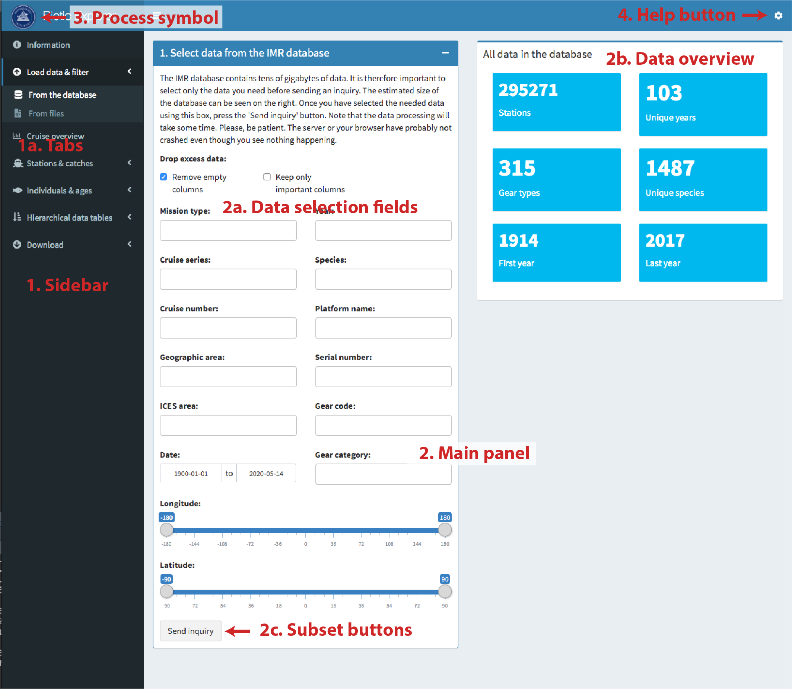

# Biotic Explorer

**A Shiny app to explore Biotic data within the Institute of Marine
Research Norway (IMR) database. Version 0.6.5 (alpha), 2020-05-28.**

This is the developmental version of the **Biotic Explorer**
[Shiny](https://shiny.rstudio.com/) app intended for examination and
manipulation of the Norwegian Maritime Data Center (NMD) standard Biotic
xml files as well as the IMR’s Biotic database (see the [User guide
section](#usage)). The application has been developed by the Stox team
at the IMR.

<!-- The official, stable, version of the app can be found from their [GitHub site](https://github.com/StoXProject).  -->

The app can be run on a desktop (i.e. your computer) for local files and
on a [server](http://astarte.imr.no/shiny) for both local files and the
entire IMR Biotic database.

## The server version

A server version of [Biotic Explorer is located on IMR
servers](http://astarte.imr.no/shiny/) and can be run through any modern
web browser given that **you access it inside the firewall of the
institute** (i.e. in the institute intranet or through a VPN).

## Installation of the desktop version

A desktop version of the app can be installed on any modern computer.
The app requires [R](https://www.r-project.org/) and
[RStudio](https://www.rstudio.com/). Install these software on your
computer following the instructions on the respective webpages. Open
RStudio and install the [Shiny](https://shiny.rstudio.com/) package:

``` r
install.packages("shiny")
```

Running the app for the first time **automatically installs and loads**
packages used by the app. If you encounter installation problems, please
read the error messages carefully. If you cannot solve these errors by
installing the required packages manually, please contact the app
maintainer.

### Running the app from your hard drive

Click “Clone or download” -\> “Download ZIP”. Find the zip file
(typically in your Downloads folder) and extract it to a desired
location. Open the app.R file in RStudio and [click “Run
app”](https://shiny.rstudio.com/tutorial/written-tutorial/lesson1/).

### Running the app directly from GitHub

You may also run the app directly from GitHub, but this will place the
files in a temporary directory and requires downloading the app every
time you restart it.

``` r
library(shiny)
shiny::runGitHub("BioticExplorer", "MikkoVihtakari")
```

## Usage

The Biotic Explorer interface consists of the sidebar, main panel,
process symbol, and help button (Figure 1). The sidebar consists of
tabs. The main panel consists of different elements depending on tab
selection. The data interface consists of data selection fields, data
overview, and subset buttons.

<div class="figure">



<p class="caption">

Figure 1. The Biotic Explorer interface consists of the sidebar (1),
main panel (2), process symbol (3), and help button (4). The sidebar
consists of tabs (1a). The main panel consists of different elements
depending on tab selection. The data interface consists of data
selection fields (2a), data overview (2b), and subset buttons (2c).

</p>

</div>

The process symbol has two states: IMR logo and *BUSY* icon (Figure 2).
The *BUSY* icon indicates that the app is processing information and you
should avoid clicking tabs, boxes or buttons while this state is active.
The processing state is only indicated when internal R processes are
running and does not include the javascript/HTML GUI processes following
the R processes. It may therefore take a little bit of time until the
app becomes responsive after the *BUSY* symbol has disappeared. Please
be patient while using the app. There may be large amounts of data
behind each processing step.

<div class="figure">


<p class="caption">

Figure 2. Process symbol states. The app is ready to receive orders when
the IMR logo is shown (left). The app is busy when the BUSY icon is
shown (right). Avoid clicking anything while the app is busy.

</p>

</div>

### Read data

#### Download data from the database

Click ‘Load data & filter -\> From the database’. Select the desired
data and click ‘Send inquiry’. The ‘BUSY’ symbol on the left top corner
will disappear when the operation is done. This may take time depending
on the size of the selected dataset. You will get an overview of
selected data and positions on the right. You can now further limit the
dataset using the ‘Subset’ button and reset the data selection using the
‘Reset’ button.

#### Read NMD Biotic xml files

Click ‘Load data & filter -\> From files -\> Browse..’ and select one or
multiple .xml files from your computer. An overview of data and sampling
station locations will be shown below. Use the ‘Filter data by’ options
to select data you want to keep. Click the ‘Subset’ button once you are
ready and see how the overview will change based on the information you
selected. The ‘Reset’ button will reset the selection

#### Resume a previous session

Click ‘Load data & filter -\> From files -\> Browse..’ and open an .rds
file saved using the app (see ‘Download’). You can now continue working
on data from an earlier Biotic Explorer session.

### Examine data

#### Cruise overview data

Click the ‘Cruise overview’ tab to see all cruises in the dataset. These
data comprise of the ‘mission’ element in NMD Biotic files.

#### Station data

The ‘Overview’ tab lists selected plots to establish an overview of the
‘fishstation’ and ‘catchsample’ elements in NMD Biotic files. ‘Map of
catches’ tab shows a location overview of catches and the ‘Examine data’
the data in a tabular form.

#### Individual data

The ‘Overview’ tab shows a general overview of the ‘individual’ and
‘agedetermination’ elements in NMD Biotic files. The ‘Species plots’
tab can be used to generate plots describing basic life-history
parameters of a species with sufficient data and the ‘Examine data’ tab
shows the data in a tabular form.

### Download

#### Export data

Data from a Biotic Explorer session can be downloaded using the
‘Download -\> Data’ tab. If you want to reopen the data in Biotic
Explorer or open the data in R, use the ‘R’ option without changing
‘Data to download’ options. This will save the data as an .rds file,
which can be opened using the
[readRDS](https://stat.ethz.ch/R-manual/R-devel/library/base/html/readRDS.html)
function in R and reopened using Biotic Explorer. Data can also be
downloaded as .zip compressed .csv files or as an Excel file. The data
are automatically placed to tabs in Excel files.

#### Export figures

You can select which Biotic Explorer figures to download and in which
format using the ‘Download -\> Figures’ tab. If you want to modify the
figures beyond the options given in the app, you may download Biotic
Explorernd modify the figure functions listed under
‘R/figure\_functions.R’.

## Contributions and contact information

Any contributions to the app are more than welcome. Please contact the
app creator Mikko Vihtakari (<mikko.vihtakari@hi.no>) to discuss your
ideas on improving the app.

## Dependencies

Running the app automatically installs following packages:

  - [shiny](https://cran.r-project.org/web/packages/shiny/index.html):
    The app has been written om Shiny.
  - [shinyFiles](https://cran.r-project.org/web/packages/shinyFiles/index.html):
    Used to up- and download files.  
  - [shinydashboard](https://cran.r-project.org/web/packages/shinydashboard/index.html):
    Used for the dashboard.
  - [DT](https://cran.r-project.org/web/packages/%20DT/index.html): Used
    for data tables.
  - [data.table](https://cran.r-project.org/web/packages/data.table/index.html):
    Used to make data processing quicker.
  - [dtplyr](https://cran.r-project.org/web/packages/dtplyr/index.html):
    Used for dplyr syntax applied to data.tables as well as quick
    database management.
  - [tidyverse](https://cran.r-project.org/web/packages/tidyverse/index.html):
    Used for data manipulation and plots.
  - [RstoxData](https://github.com/StoXProject/RstoxData): Used to read
    NMD .xml files.
  - [devtools](https://cran.r-project.org/web/packages/devtools/index.html):
    Used to download the dependencies only available on GitHub.
  - [leaflet](https://cran.r-project.org/web/packages/leaflet/index.html):
    Used for interactive maps.
  - [leaflet.minicharts](https://cran.r-project.org/web/packages/leaflet.minicharts/index.html):
    Used for interactive maps.
  - [mapview](https://cran.r-project.org/web/packages/mapview/index.html):
    Used for interactive maps.
  - [plotly](https://cran.r-project.org/web/packages/plotly/index.html):
    Used for interactive plots.
  - [openxlsx](https://cran.r-project.org/web/packages/openxlsx/index.html):
    Used to write MS Excel files.
  - [scales](https://cran.r-project.org/web/packages/scales/index.html):
    Used to scale ggplot axes.
  - [fishmethods](https://cran.r-project.org/web/packages/fishmethods/index.html):
    Used to fit growth models
  - [viridis](https://cran.r-project.org/web/packages/viridis/index.html):
    Provides viridis color scale for Leaflet maps.
  - [DBI](https://cran.r-project.org/web/packages/DBI/index.html): Used
    for database operations
  - [MonetDBLite](https://github.com/MonetDB/MonetDBLite-R): The
    database interface package for the BioticExplorer database

## News

2020-05-13 Added complete database support. All features visioned at the
beginning of the development have now been incorporated. Making the
features to work as planned, bug-fixing and polish remain.

2020-01-22 An update preparing for beta-release. Many new added
features. Unstable, full of bugs and undocumented.

2019-07-11 Fixed a number of Windows related problems. The app should
(hopefully) work now on most institutional machines.

2019-07-08 Uploaded the first alpha version. The app works, but does not
contain all features yet. This version is meant for internal testing.
